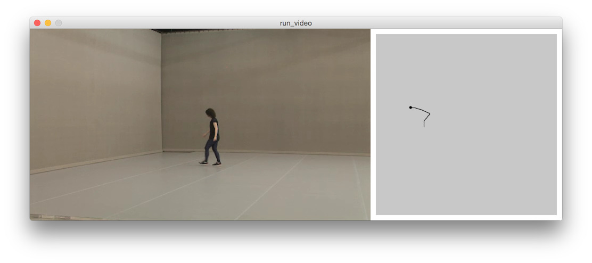

# Piecemaker-API Examples for Processing

Florain Jennet's Piecemaker examples adpated from the hackpad.  
See [here](https://motionbank.hackpad.com/Piecemaker-2-Piecemeta-U72bHyE9NTc).

## Usage ##
To make these examples work you need to:

* Add the [Piecemaker Library](https://github.com/bitcraftlab/piecemaker-api-client/releases/tag/0.0.21-p5lib) to Processing.
* Add your credentials to ``secret.pde`` in the respective sketch (See ``config.pde``)

## Nice Extras ##

Videos are downloaded automatically to your data folder, when you run the video sketch for the first time.