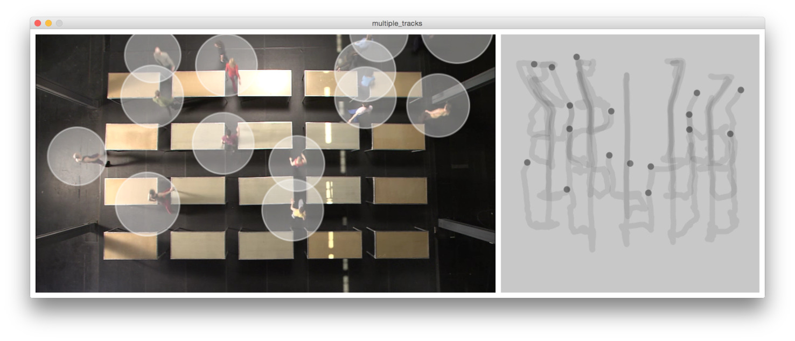

# Piecemaker-API Examples for Processing #

## Getting Started ##

Florain Jennet's Piecemaker examples adpated from the hackpad.
See [here](https://motionbank.hackpad.com/Piecemaker-2-Piecemeta-U72bHyE9NTc).

##### Nice Extras #####

The Video is downloaded automatically to your data folder, when you run the video sketch for the first time.

## More Examples ##

I added a *multiple tracks* example based on William Forsythe *One Flat Thing reproduced*.
.

When you run this example for the first time, it will download all the video + data.
You might need to increase your Processing Memory to make that work...

## Usage ##
To make these examples work you need to:

* Add the [Piecemaker Library](https://github.com/bitcraftlab/piecemaker-api-client/releases/tag/0.0.21-p5lib) to Processing.
* Add your credentials to ``secret.pde`` in the respective sketch (See ``config.pde``)

